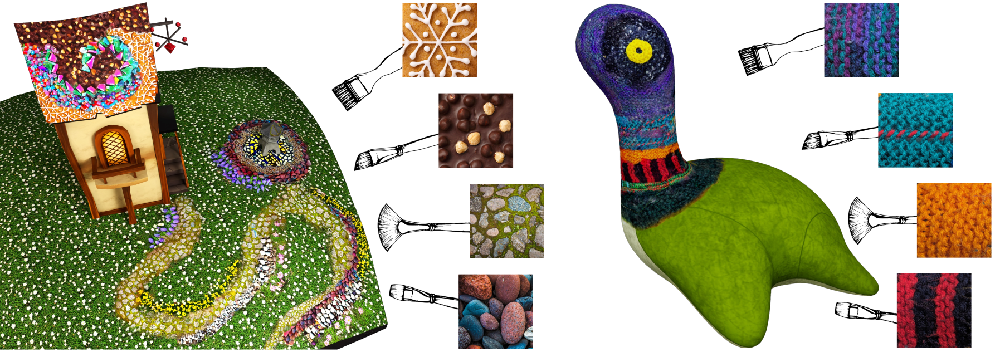

# Diffusion Texture Painting



Image attribution: 3D models from Sketchfab [Fantasy House](https://sketchfab.com/3d-models/fantasy-house-ed9c83a3f88a4b5682a40e1180ab91e0) by LowlyPoly, [Stuffed Dino Toy](https://sketchfab.com/3d-models/stuffed-dino-toy-d69e9bb7bfc6451993bf84f3e763a28a) by Andrey.Chegodaev.

**Diffusion Texture Painting**<br>
[Anita Hu](https://research.nvidia.com/labs/toronto-ai/author/anita-hu),
[Nishkrit Desai](https://research.nvidia.com/labs/toronto-ai/author/nishkrit-desai),
[Hassan Abu Alhaija](http://hassanhaija.com),
[Seung Wook Kim](https://seung-kim.github.io/seungkim),
[Masha Shugrina](https://shumash.com) <br>
**[Paper](https://drive.google.com/file/d/1mPy_hU5KPsxMBCkE6np1jYDTwgNVPqpU/view?usp=sharing), [Project Page](https://research.nvidia.com/labs/toronto-ai/DiffusionTexturePainting/)**

Abstract: *We present a technique that leverages 2D generative diffusion models (DMs) for interactive texture painting on the surface of 3D meshes. Unlike existing texture painting systems, our method allows artists to paint with any complex image texture, and in contrast with traditional texture synthesis, our brush not only generates seamless strokes in real-time, but can inpaint realistic transitions between different textures. To enable this application, we present a stamp-based method that applies an adapted pre-trained DM to inpaint patches in local render space, which is then projected into the texture image, allowing artists control over brush stroke shape and texture orientation. We further present a way to adapt the inference of a pre-trained DM to ensure stable texture brush identity, while allowing the DM to hallucinate infinite variations of the source texture. Our method is the first to use DMs for interactive texture painting, and we hope it will inspire work on applying generative models to highly interactive artist-driven workflows.*

For business inquiries, please visit our website and submit the form: [NVIDIA Research Licensing](https://www.nvidia.com/en-us/research/inquiries/).

## Highlights
* [Getting Started](https://github.com/nv-tlabs/DiffusionTexturePainting#getting-started)
  * [Model Training / Pretrained Weights](https://github.com/nv-tlabs/DiffusionTexturePainting#1-diffusion-model-training)
  * [TensorRT Inference](https://github.com/nv-tlabs/DiffusionTexturePainting#2-tensorrt-model-inference)
  * [Kit App](https://github.com/nv-tlabs/DiffusionTexturePainting#3-diffusion-texture-painting-app)
* [Kit App Tutorial](https://github.com/nv-tlabs/DiffusionTexturePainting/kit_app/README.md)
* [License](https://github.com/nv-tlabs/DiffusionTexturePainting#license)
* [Citation](https://github.com/nv-tlabs/DiffusionTexturePainting#citation)

## Getting Started

Verified on Linux Ubuntu 20.04. 

### 1. Diffusion Model Training

This module provides the training script for finetuning a pre-trained stable-diffusion inpainting model to support image-conditioning via
a custom image encoder using LoRA. The resulting image encoder checkpoint and LoRA weights will be needed in the next module. 

To train the model from scratch, follow the instructions [here](training/README.md).

Download the pretrained models and unzip into the following folder
```bash
cd trt_inference 
wget https://nvidia-caat.s3.us-east-2.amazonaws.com/diffusion_texture_painting_model.zip
unzip diffusion_texture_painting_model.zip
```

### 2. TensorRT Model Inference

This module accelerate the diffusion model inference speed using TensorRT. The model inference is isolated in a docker container
and communicates with the Texture Painting App via websocket. 

#### Docker setup

Install nvidia-docker using [these intructions](https://docs.nvidia.com/datacenter/cloud-native/container-toolkit/install-guide.html#docker).

Build docker image
```bash
cd trt_inference
docker build . -t texture-painter
```

#### Run server
Launch docker (first time will take longer to build the trt model)
```bash
cd trt_inference
mkdir engine  # cache the built trt model files
docker run -it --rm --gpus all -p 6060:6060 -v $PWD/engine:/workspace/engine texture-painter
```
Wait until you see "TRTConditionalInpainter ready", that means it has successfully built the trt model. Then you can exit and continue below.

### 3. Diffusion Texture Painting App

This module contains the app for texture painting on UV-mapped 3D meshes.

#### Build the app
```bash
cd kit_app && bash build.sh
```

#### Launch the app
Option 1: Launch inference server and app separately

To paint with the diffusion model, ensure that the TRT inference server is running before launching the app.
```bash
bash launch_trt_server.sh
```
Launch kit application.
```bash
bash launch_app.sh
```

Option 2: Launch together

With tmux installed, launch the inference server and app at the same time. 
```bash
bash launch_all.sh
```

## Kit App Tutorial
For how to use the app, refer to the tutorial [here](kit_app/README.md).

## License

The repository contains research code integrated into a kit application, based on the [kit-app-template](https://github.com/NVIDIA-Omniverse/kit-app-template). 
All code under the [kit_app](kit_app) folder is subject to the terms of [Omniverse Kit SDK](./kit_app/LICENSE), with the exception of the subfolder [kit_app/source/extensions/aitoybox.texture_painter](kit_app/source/extensions/aitoybox.texture_painter), which is governed by [NVIDIA Source Code License](./kit_app/source/extensions/aitoybox.texture_painter/docs/LICENSE.txt).

All code in the repository not under the [kit_app](kit_app) folder is also subject to [NVIDIA Source Code License](LICENSE.txt).

## Citation
```text
@article{texturepainting2024,
	  author = {Hu, Anita and Desai, Nishkrit and Abu Alhaija, Hassan and Kim, Seung Wook 
	      and Shugrina, Maria},
	  title = {Diffusion Texture Painting},
	  booktitle = {ACM SIGGRAPH 2024 Conference Proceedings},
	  year = {2024},
	}
```
